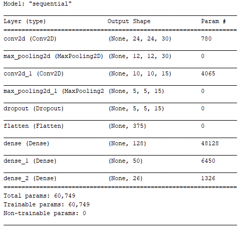
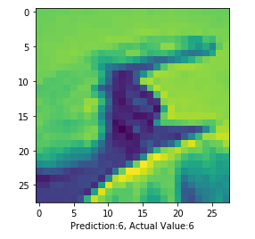

# Sign Language MNIST


The dataset format is patterned to match closely with the classic MNIST. Each training and test case represents a label (0-25) as a one-to-one map for each alphabetic letter A-Z (and no cases for 9=J or 25=Z because of gesture motions). The training data (27,455 cases) and test data (7172 cases) (used as validation data in this project) are approximately half the size of the standard MNIST but otherwise similar with a header row of label, pixel1,pixel2....pixel784 which represent a single 28x28 pixel image with grayscale values between 0-255. The original hand gesture image data represented multiple users repeating the gesture against different backgrounds. The Sign Language MNIST data came from greatly extending the small number (1704) of the color images included as not cropped around the hand region of interest. To create new data, an image pipeline was used based on ImageMagick and included cropping to hands-only, gray-scaling, resizing, and then creating at least 50+ variations to enlarge the quantity. The modification and expansion strategy was filters ('Mitchell', 'Robidoux', 'Catrom', 'Spline', 'Hermite'), along with 5% random pixelation, +/- 15% brightness/contrast, and finally 3 degrees rotation. Because of the tiny size of the images, these modifications effectively alter the resolution and class separation in interesting, controllable ways.

This is what the gray-scaled output looks like:


Although the model achieves a high accuracy on the training and the validation data-set, it is extremely inaccurate in its practicality, because of it being trained only on a certain skin-tone. However, this notebook is to demonstrate how a CNN can be built in order to work on the Sign Language MNIST dataset.

## Model Summary

The model is a convolutional neural network, the summary can be given as follows:



## Output

The model achieves a training accuracy of ```~99``` and a validation accuracy of ```~93```. It performs extremely well on the given data in the testing dataset but has an extremely low accuracy on random images.



